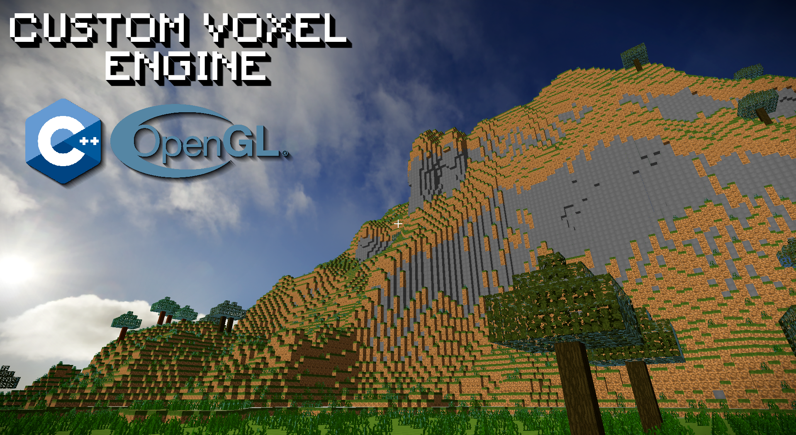
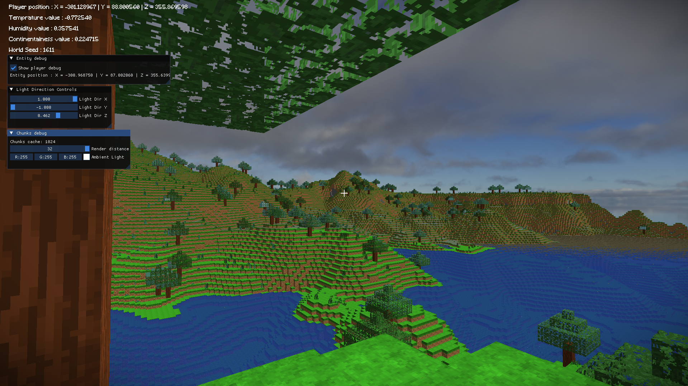
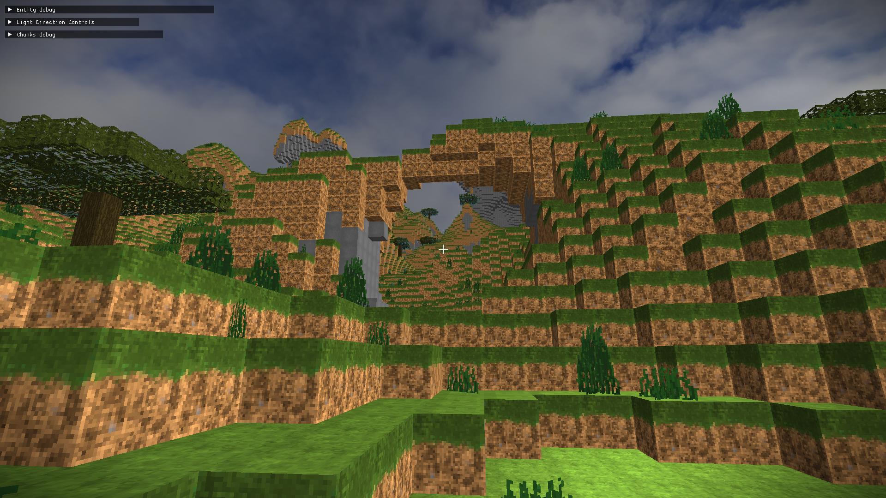
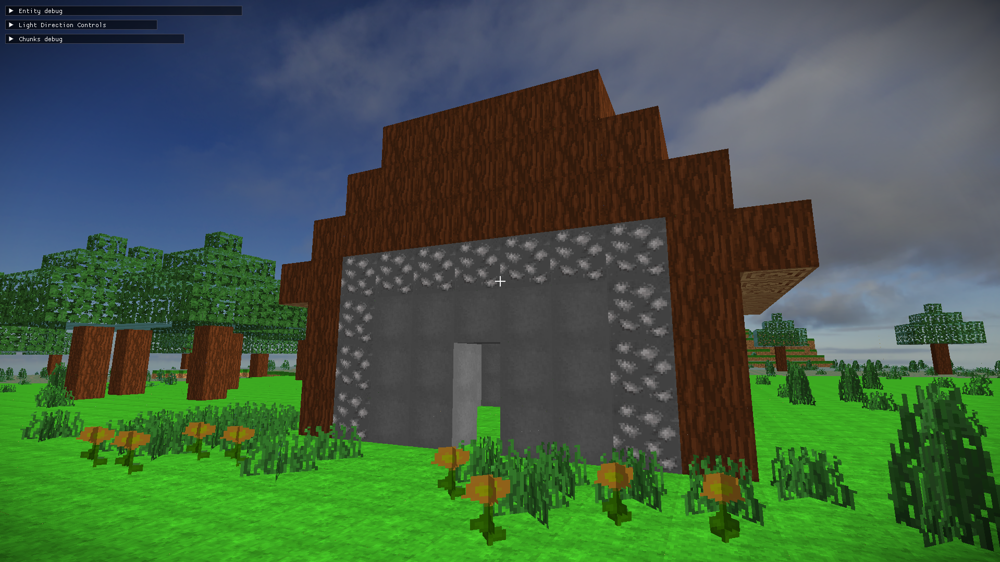

# MineCraft: C++ Edition

> Tech Stack : C++, OpenGL, GLFW, ASSIMP







## Build Instructions
### 🧰 Requirements
- CMake 3.15+
- Visual Studio 2022
- C++17
- MSYS2 

### 🧾 Build Steps (Release Mode)
- Use MSYS2 MINGW64 terminal
```bash
cmake -S . -B build -G "Visual Studio 17 2022" -A x64 -DCMAKE_BUILD_TYPE=Release
cmake --build build --config Release
```
- The exe will generate in the root folder, have fun !